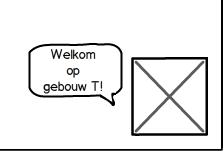

---
title: Functioneel Ontwerp
group: Team Awesomer - ICTSE1a - KBS1
author:
- name: Arjan van der Weide
  snr: S1070619
- name: Robert Leeuwis
  snr: S1062367
- name: Joram Schrijver
  snr: S1067040
- name: Wouter Vogelzang
  snr: S1073684
- name: Evan van Urk
  snr: S1071256
- name: Janjaap Ree
  snr: S1066187
- name: Roelof Roos
  snr: S1073508
version: 0.1
date: November 2014
...

# Inleiding
<<<<<<< HEAD

# 3 Weergave dialoog
Als gebruiker wil ik de gesproken tekst op het scherm weergegeven zien zodat ik mee kan lezen met de gesproken tekst.

## 3a Teksten schrijven
### Toelichting
De teksten die de avatar moet kunnen oplezen/tonen op het scherm moeten verzonnen worden.

## 3b Opslag systeem teksten
### Toelichting
Om het systeem te laten werken moeten de teksten die de avatar kan uitspreken ergens opgeslagen staan zo gegroepeerd zijn dat ze op het juiste moment aangeroepen kunnen worden.

## 3c Weergave teksten
### Toelichting
De teksten moeten op het juiste moment op de juiste manier getoond worden. De teksten moeten in een panel als een soort van tekstballon worden weergegeven zodat het lijkt alsof ze door de avatar uitgesproken worden.

## Testscenarios

| Scenario  | Verwachte uitkomst  |
|:---|:---|
| Teksten die gebruikt worden op een centrale plek opgeslagen in een .xml bestand | Pass |
| De gekozen tekst wordt 1 keer weergegeven | Pass |
| Er wordt random een bericht weergeven uit de daarbijhorende catagorie | Pass |
| Berichten kunnen worden gewijzigd/toegevoegd door alleen de .xml aan te passen | Pass |
=======
Dit is het functioneel ontwerp voor Team Awesomer voor het Project Novi product.

# Use-Case Diagram
Hier komt ons Use-Case Diagram

# 1. Zichtbare avatar
Als gebruiker willen we een zichtbare avatar op het scherm zien.
## Omschrijving
Omdat we graag een avatar op het scherm zien verschijnen om het product aantrekkelijker te maken voor gebruikers, hebben we een avatar vor onze applicatie nodig.
Deze avatar is altijd zichtbaar in de gebruikersinterface.

## Schermontwerp

>>>>>>> 456c55331b0eabe1d6199c94c8b5b0c16ee1db76
