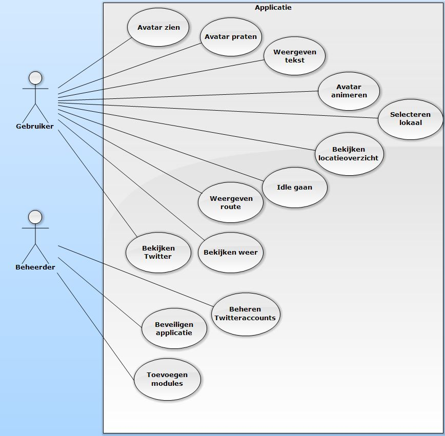
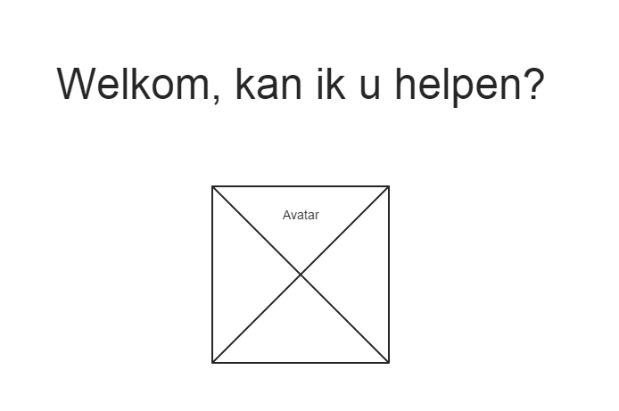
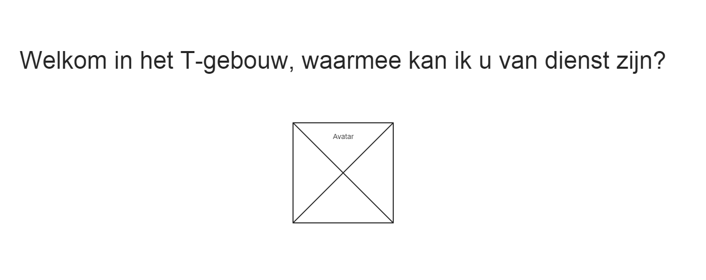
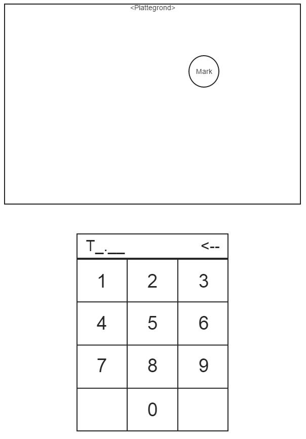
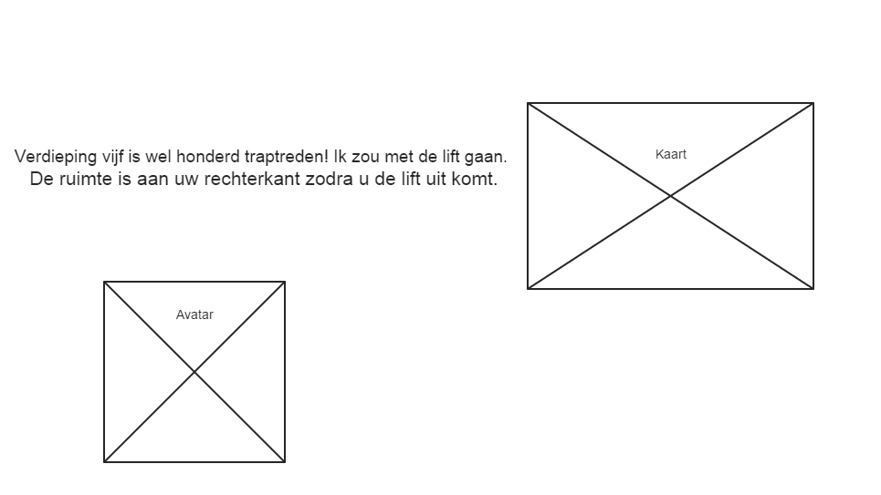
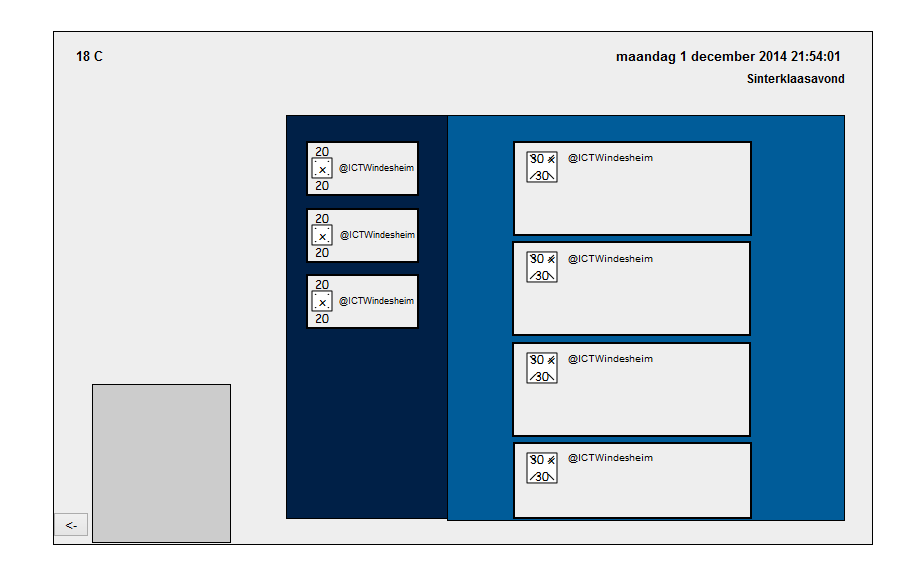
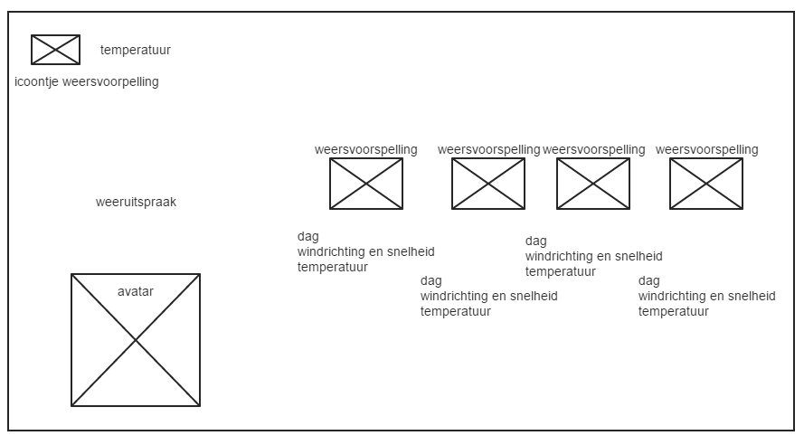
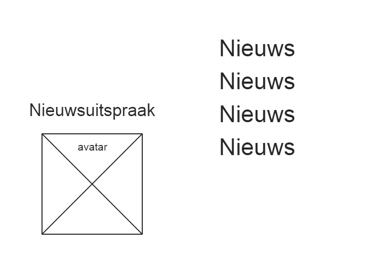
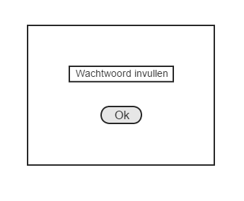
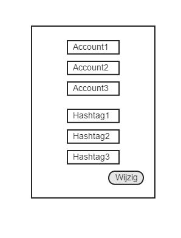

---
title: Functioneel Ontwerp
group: Team Awesomer - ICTSE1a - KBS1
author:
- name: Arjan van der Weide
  snr: S1070619
- name: Robert Leeuwis
  snr: S1062367
- name: Joram Schrijver
  snr: S1067040
- name: Wouter Vogelzang
  snr: S1073684
- name: Evan van Urk
  snr: S1071256
- name: Janjaap Ree
  snr: S1066187
- name: Roelof Roos
  snr: S1073508
version: 1.2
date: November 2014
...

# Inleiding

Dit project wordt uitgevoerd door studenten van de Hogeschool Windesheim binnen Major 2 van de Informatica-opleiding. Dit document bevat het functioneel ontwerp van de applicatie die de studenten gaan maken.

De applicatie wordt in C# met behulp van MVC geprogrammeerd. Het project zal volgens de Scrum methodologie worden aangepakt. Tevens wordt er gebruik gemaakt van GitLab voor de versiecontrole en het beheer van de bestanden. Het gebruik van Scrumtooling (zoals ScrumDo, Trello, enz.) is tijdens dit project niet toegestaan.

De user stories zijn in dit document niet voorzien van testscenario's aangezien deze vermeld staan in ons testplan.

# Use-Case Diagram

# User Stories

## Zichtbare avatar

Als gebruiker wil ik een avatar kunnen zien, zodat ik interactie kan tonen met de applicatie.

### Toelichting

Het primaire doel van onze applicatie is om een avatar te laten zien die de gebruiker verder kan helpen met de mogelijke modules. Tevens maakt dit het product aantrekkelijker.

### Schermontwerp

Onze avatar heeft oorspronkelijk dit ontwerp, maar in de loop van het project hebben we iemand gekregen die de grafische ontwerpen van ons project zou gaan maken. 

Dit is het ontwerp van onze grafisch designer:

En tot slot is dit een ontwerp van het scherm waarin de avatar gecentreerd op het scherm komt te staan:

## Pratende avatar

Als gebruiker wil ik dat de avatar tekst uitspreekt via audio, zodat ik meer het gevoel heb dat ik met een levend wezen te maken heb. 

### Toelichting

Om de aandacht te trekken van langslopende personen en om de gebruiker het gevoel te geven met een levend wezen te maken te hebben, is het van belang dat de avatar ook kan praten.
Op deze manier wordt de interactie tussen de gebruiker en het scherm levendiger en krijgt de gebruiker meer het idee echt geholpen te worden.

## Weergave dialoog

Als gebruiker wil ik dat de uitgesproken tekst ook op het scherm weergegeven wordt, zodat ik mee kan lezen met de gesproken tekst.

### Toelichting

Mensen die de uitgesproken tekst niet helemaal gevolgd hebben, kunnen dit teruglezen op de applicatie voor meer duidelijkheid. 

### Schermontwerp

## Animeren avatar

Als gebruiker wil ik dat de avatar animeert, zodat de interactie met de avatar nog echter lijkt en de gebruiker het gevoel krijgt van een levend persoon.

### Toelichting

Om wat leven in de avatar te schoppen, willen we dat de avatar kan animeren. Op deze manier wordt de interactie met de avatar nog beter.

### Schermontwerp

Aangezien het lastig is om een schermontwerp te maken waarin weergegeven wordt dat de avatar animeerd, is van deze user story geen schermontwerp aanwezig.

## Gevarieerde dialoog

Als gebruiker wil ik dat de avatar verieert tussen de uitgesproken teksten, zodat ik niet de hele tijd naar dezelfde tekst luister.

### Toelichting

Het wordt redelijk saai als de avatar alleen maar dezelfde teksten uitspreekt. Tevens is het de bedoeling dat de avatar verschillende teksten heeft voor verschillende modules.

### Schermontwerp

## Overzicht locaties
Als gebruiker wil ik een overzicht van alle lokalen in het T-gebouw, zodat ik kan opzoeken waar ik moet zijn.

### Toelichting
Voor mensen die onbekend zijn in het gebouw, is het handig om een overzicht te hebben van de plattegrond.
Er moet daarom een module komen waarop gebruikers een overzicht kunnen vinden van alle lokalen die aanwezig zijn binnen het T-gebouw.
Dit moet per verdieping kunnen gebeuren, dus gebruikers hebben de mogelijkheid om deze te kunnen selecteren.

### Schermontwerp

## Selecteren lokaal
Als gebruiker wil ik een lokaal selecteren, zodat ik weet waar elk lokaal zich bevindt.

### Toelichting
De gebruiker moet een specifiek lokaal kunnen selecteren, zodat een lokaal makkelijker gevonden kan worden.
Dit kan handig zijn voor mensen die onbekend zijn in het gebouw, maar ook voor studenten die een lokaal zoeken.

## Weergave route

Als gebruiker wil ik de route naar een bepaalde ruimte kunnen vragen, zodat ik weet hoe ik bij bepaalde lokalen moet komen.

### Toelichting

Voor mensen die onbekend zijn in het T-gebouw, is het wel handig om een routebeschrijving mee te geven naar een ingevuld lokaal. Zo kan de gebruiker makkelijk naar een lokaal komen.

### Schermontwerp

## Idle

Als gebruiker wil ik dat het scherm na een bepaald aantal minuten naar een andere module switched, zodat niet constant hetzelfde scherm zichtbaar is.

###Toelichting

Het scherm moet niet na gebruik gewoon zo achtergelaten worden, dus moet het scherm heen en weer springen van module. Zo wordt ook op momenten dat het scherm niet gebruikt wordt, toch nog informatie gegeven.

###Schermontwerp

Het is praktisch niet mogelijk om in een afbeelding te laten zien wat een scherm doet na twee minuten, dus ontbreekt dit schermontwerp.

## Twitterfeed

Als gebruiker wil de mogelijkheid hebben om een twittermodule in te zien, zodat ik de laatste nieuwtjes via twitter kan doornemen.

### Toelichting

We wilden een module maken waarin de twitteraccounts van Windesheim en ICT over het algemeen bekeken kunnen worden.

### Schermontwerp

## Weeroverzicht

Als gebruiker wil ik een overzicht van het weer kunnen zien, zodat ik weet of er slecht weer aankomt.

### Toelichting

Een module voor het weer zorgt ervoor dat gebruikers weten wat voor weer er aan staat te komen en dat kan invloed hebben op het naar huis gaan van mensen, aangezien ze kunnen zien of ze droog over kunnen komen.

### Schermontwerp

## Nieuwsoverzicht

Als gebruiker wil ik recent nieuws kunnen zien van diverse nieuwsbronnen, zodat ik op de hoogte blijf van de actuele gebeurtenissen.

### Toelichting

Gebruikers moeten via onze applicatie op de hoogte kunnen blijven van het actuele nieuws. Dit is ook interessant voor niet-studenten.

### Schermontwerp

## Treintijden

Als gebruiker wil ik de actuele vertrektijden van de trein kunnen zien, zodat ik weet of ik mijn trein nog kan halen.

### Toelichting

Gebrukers kunnen via deze module de actuele treintijden zien en ze kunnen zien of er een trein is weggevallen. Met deze informatie kan ingeschat worden of de trein nog haalbaar is.

## Beveiligen applicatie

Als beheerder wil ik dat gebruikers de applicatie niet kunnen veranderen of afsluiten, zodat de applicatie kan blijven draaien.

### Toelichting

Gebruikers mogen niet de mogelijkheid hebben om de applicatie af te sluiten of er dingen aan te veranderen, want de applicatie moet gewoon blijven draaien zonder aanpassingen.
Hier hebben we voor gezorgd door geen toetsenbord beschikbaar te stellen op het scherm.

## Beheren Twitteraccounts

Als beheerder wil ik de twitteraccounts kunnen beheren, zodat ik nieuwe accounts op het scherm kan laten tonen.

### Toelichting

De mogelijkheid bestaat dat een accounts of hashtag helemaal niet meer wordt gebruikt. In dat geval kan een beheerder dit account vervangen door een ander.

### Schermontwerp

## Toevoegen modules

Als beheerder wil ik dat er makkelijk modules toegevoegd kunnen worden, zodat ik de applicatie kan uitbreiden.

### Toelichting

Als er een andere groep met onze opdracht verder gaat in de toekomst, kunnen er modules kunnen worden toegevoegd.
De gebruikerhandleiding beschrijft precies hoe dit te werk gaat, dus hier zijn in dit document verder geen details van.
