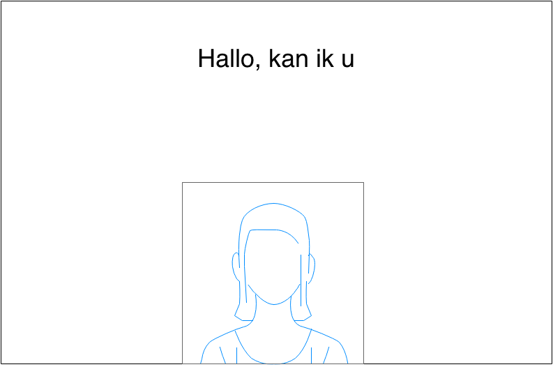

---
title: Functioneel Ontwerp
group: Team Awesomer - ICTSE1a - KBS1
author:
- name: Arjan van der Weide
  snr: S1070619
- name: Robert Leeuwis
  snr: S1062367
- name: Joram Schrijver
  snr: S1067040
- name: Wouter Vogelzang
  snr: S1073684
- name: Evan van Urk
  snr: S1071256
- name: Janjaap Ree
  snr: S1066187
- name: Roelof Roos
  snr: S1073508
version: 0.1
date: November 2014
...

# Inleiding
Dit is het functioneel ontwerp voor Team Awesomer voor het Project Novi product.

# Use-Case Diagram
Hier komt ons Use-Case Diagram

# Zichtbare avatar
Als gebruiker willen we een zichtbare avatar op het scherm zien. In onderstaande afbeelding is te zien hoe de avatar er standaard uit ziet.

## Omschrijving
Omdat we graag een avatar op het scherm zien verschijnen om het product aantrekkelijker te maken voor gebruikers, hebben we een avatar vor onze applicatie nodig.
Deze avatar is altijd zichtbaar in de gebruikersinterface.

## Schermontwerp

# Applicatiescherm
Als gebruiker wil ik een scherm zien waarop een ruimte voor een avatar is en waarop ik teksten kan lezen die de avatar zegt.

## Test Cases
### Opstarten
Bij het opstarten van de appplicatie opent het applicatiescherm waarop een (ruimte voor) een avatar is en waarop ruimte is voor diverse tegels.

### Klikken
Als ik klik op een tegel, krijg ik een reactie die van toepassing is op de tegel waar ik op klik.
Als ik klik op de avatar, krijg ik een toepasselijke reactie.

# Pratende avatar
Als gebruiker wil ik de tekst via audio te horen krijgen, zodat ik meer het gevoel heb dat ik met een levend wezen te maken heb. 

### Toelichting
Om de aandacht te trekken van langslopende personen en om de gebruiker het gevoel te geven met een levend wezen te maken te hebben, is het van belang dat de avatar ook kan praten.
Op deze manier wordt de interactie tussen de gebruiker en het scherm levendiger en krijgt de gebruiker meer het idee echt geholpen te worden.

### Testscenario's
| Scenario  | Verwachte uitkomst    |
| :---      | :---                  |
| Bij het verschijnen van nieuwe tekst op het scherm, wordt deze uitgesproken. | Pass |

# Weergave dialoog
Als gebruiker wil ik de gesproken tekst op het scherm weergegeven zien zodat ik mee kan lezen met de gesproken tekst.

## Teksten schrijven
### Toelichting
De teksten die de avatar moet kunnen oplezen/tonen op het scherm moeten verzonnen worden.

## Opslag systeem teksten
### Toelichting
Om het systeem te laten werken moeten de teksten die de avatar kan uitspreken ergens opgeslagen staan zo gegroepeerd zijn dat ze op het juiste moment aangeroepen kunnen worden.

## Weergave teksten
### Toelichting
De teksten moeten op het juiste moment op de juiste manier getoond worden. De teksten moeten in een panel als een soort van tekstballon worden weergegeven zodat het lijkt alsof ze door de avatar uitgesproken worden.

## Testscenarios

| Scenario  | Verwachte uitkomst  |
|:---|:---|
| Teksten die gebruikt worden op een centrale plek opgeslagen in een .xml bestand | Pass |
| De gekozen tekst wordt 1 keer weergegeven | Pass |
| Er wordt random een bericht weergeven uit de daarbijhorende catagorie | Pass |
| Berichten kunnen worden gewijzigd/toegevoegd door alleen de .xml aan te passen | Pass |

#Overzicht locaties
Als gebruiker wil ik een overzicht van alle lokalen in het T gebouw zodat ik kan opzoeken waar ik moet zijn.

## Bruikbaar maken data
### Toelichting
Om het overzicht van alle lokalen te kunnen realiseren zullen de aangeleverde kaarten en coördinaten  kloppend moeten zijn en zodanig zijn aangepast dat het toegpast kan worden in de applicatie.

## Weergave plattegrond
### Toelichting
Nadat de kaarten kloppend zijn gemaakt moeten ze in de applicatie komen te staan en op het juiste moment weergegeven worden.

## Selecteren verdieping
### Toelichting
Om de kaarten overzichtelijk te houden kan de gebruiker zelf aangeven van welke verdieping hij de kaart wil zien.

##Testscenarios
|Scenario | Verwachte uitkomst |
|:---|:---|
| Per verdieping wordt de juiste kaart aangeroepen | Pass |
| Het is niet mogelijk om meerdere kaarten tegelijk te zien | Pass |
| De kaarten zijn goed leesbaar | Pass |

#Idle

##Transitie & Detectie
###Toelichting
Om ervoor te zorgen dat elke nieuwe gebruiker wel weer vanaf het hoofdscherm begint, moet het scherm na inactiviteit voor een bepaalde tijd weer terugkeren naar het hoofscherm.

##Testscenario's

|Scenario | Verwachte uitkomst |
|:---|:---|
| De applicatie keert weer terug naar het hoofdscherm na een bepaalde tijd | Pass |
| De applicatie keert wel terug naar het hoofscherm, maar houdt geen rekening met de tijd  | Fail |
| Bij terugkeren naar het hoofdscherm werkt de applicatie hetzelfde als dat hij opnieuw wordt opgestart | Pass |
