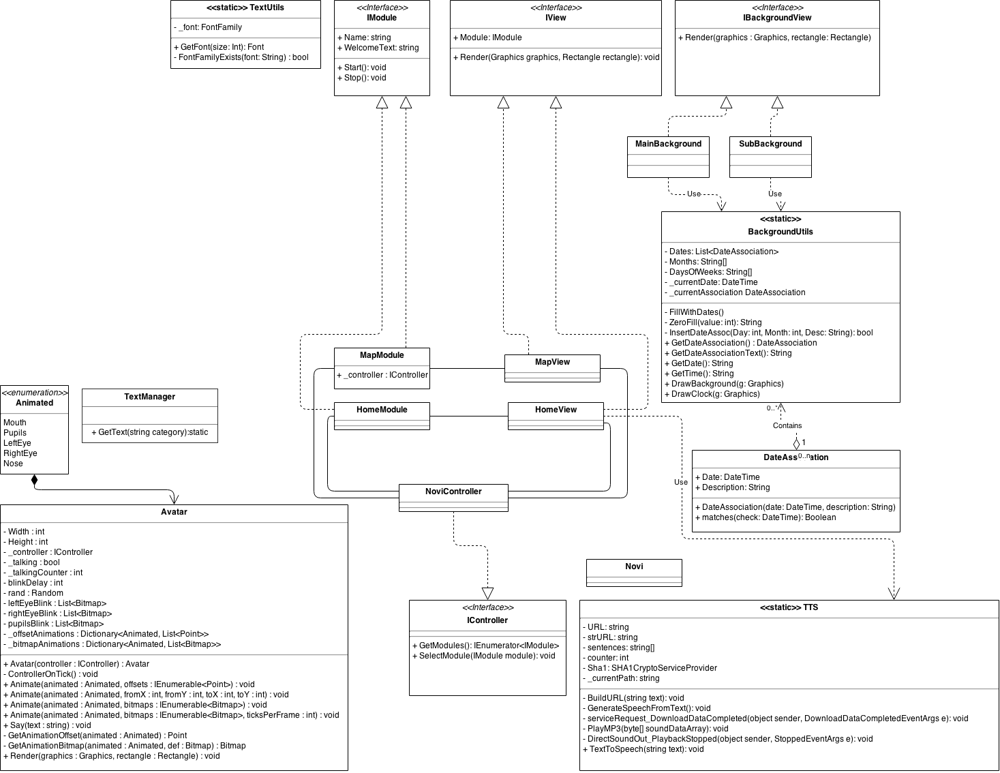
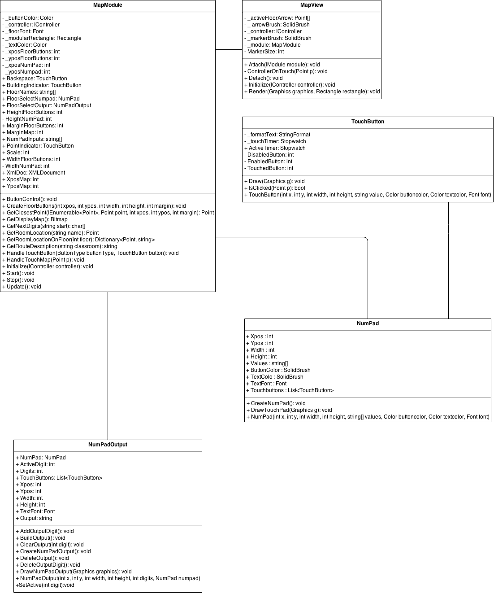
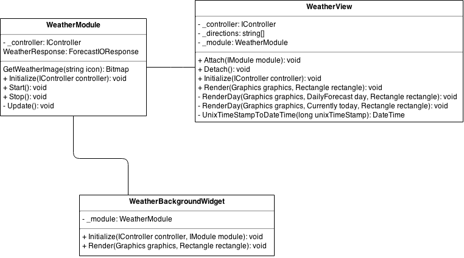
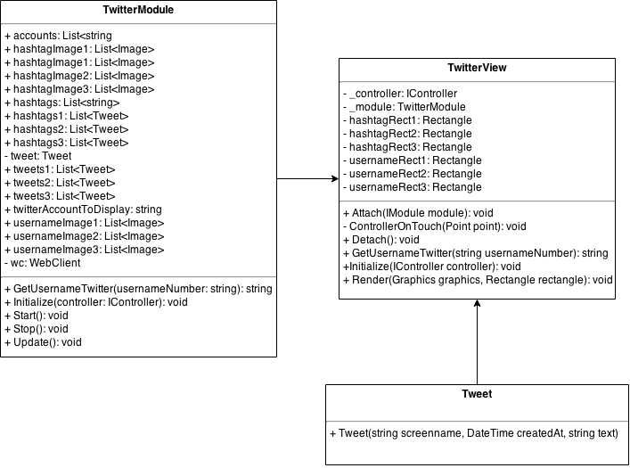
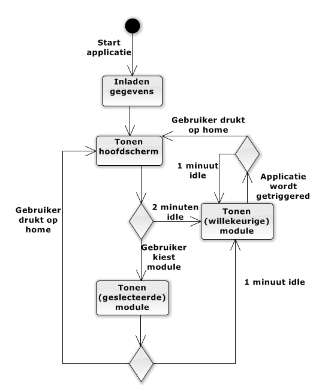
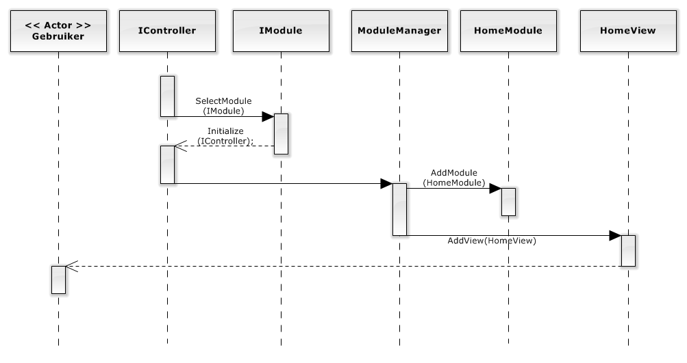

---
title: Technisch Ontwerp
authors:
- name: Arjan van der Weide
  snr: S1070619
- name: Robert Leeuwis
  snr: S1062367
- name: Joram Schrijver
  snr: S1067040
- name: Wouter Vogelzang
  snr: S1073684
- name: Evan van Urk
  snr: S1071256
- name: Janjaap Ree
  snr: S1066187
- name: Roelof Roos
  snr: S1073508
version: 0.1
date: November 2014
...

# Inleiding
In dit document staan de technische aspecten van het project beschreven.
Om een goed beeld te kunnen geven van de applicatie is het technisch ontwerp opgedeeld in verschillende delen.
Het technisch ontwerp bevat een klassediagram tesamen met diagrammen die specifieke processen beter in beeld zullen brengen. Er zullen hiervoor schematechnieken gebruikt worden die ons zijn geleerd.
Diagrammen zullen kort toegelicht worden om eventuele verwarring te voorkomen. Daarnaast zal het technisch ontwerp op globaal niveau de complexere onderdelen van het project beschrijven.

========
# Ontwerpkeuzes

## Modules
Een eis van de opdrachtgever was om de applicatie zo op te zetten dat deze uit te breiden zou zijn door andere studenten.
Om deze reden hebben we ervoor gekozen om de applicatie op te delen in verschillende modules. Deze modules erfen een groot deel van hun attributen over zodat de layout (plaatsing avatar, datum/tijd, etc.) voor iedere module gelijk is.
Iedere module werkt met een Module en een View klasse. De achterliggende gedachte is dat de Module klasse gebruikt wordt om gegevens te verzamelen die in de view klasse getekent worden. Iedere aangemaakte module wordt automatisch getekent op het hoofdscherm met een icoontje dat gespecificeerd kan worden door de gebruiker.

## Diagrammen

Ons klassendiagram hebben we opgedeeld in meerdere kleine diagrammen zodat iedere module zijn eigen klassendiagram heeft.
Naast het klassendiagram is er een activitydiagram dat illustreert hoe de gebruiker door de verschillende modules kan navigeren en hoe de idle timer werkt.
Als laatste is er een sequence diagram gemaakt om het openen van een module te demonstreren.

=======
# Klassendiagram

In dit eerste klassendiagram worden de 'algemene' acties van onze applicatie afgehandeld.
Het animeren van de avatar, inladen van de teksten, opbouwen van de homemodule en de text to speech gebeurt hier.
Tijdens het ontwikkelen is er rekening gehouden met eventuele uitbreidingen die gemaakt kunnen worden op de applicatie.
Dit is ook de reden dat iedere module een eigen klassendiagram heeft.

======

Dit klassendiagram beschrijft de structuur van de kaart module waar gebruikers de locatie van een ruimte kunnen opvragen.
De module maakt gebruik van een Module en een view klasse. In de module worden alle attributen opgehaald die uiteindelijk in de view getekend moeten worden.

======

De weermodule werkt op dezelfde manier als de kaart module. De gegevens die in de WeatherModule opgehaald worden zijn afkomstig van Forecast.io
Daarnaast heeft de weermodule als extra uitbreiding een actuele voorspelling van het weer die ook op de homemodule is te zien.

======

De twittermodule wordt gebruikt om recente tweets te weergeven van accounts en hashtags die in het beheerspaneel aan te passen zijn.
Informatie wordt binnengehaald door middel van de API die twitter voor developers beschikbaar heeft gesteld.
Gegevens worden om de 5 minuten opnieuw opgehaald.

=======
# Activitydiagram

In het bovenstaande diagram wordt globaal aangegeven op welke manier een gebruiker tussen de verschillende schermen kan schakelen.
Binnen het diagram kan een 'willekeurige module' ook het hoofdscherm zijn, dit is compleet willekeurig.

=======
# Sequencediagram

In dit sequence diagram staat beschreven hoe de applicatie door de verschillende klasses en interfaces loopt om zo uiteindelijk een module op het scherm te kunnen tonen.
In dit geval wordt er van uitgegaan dat de HomeModule aangeroepen wordt.
