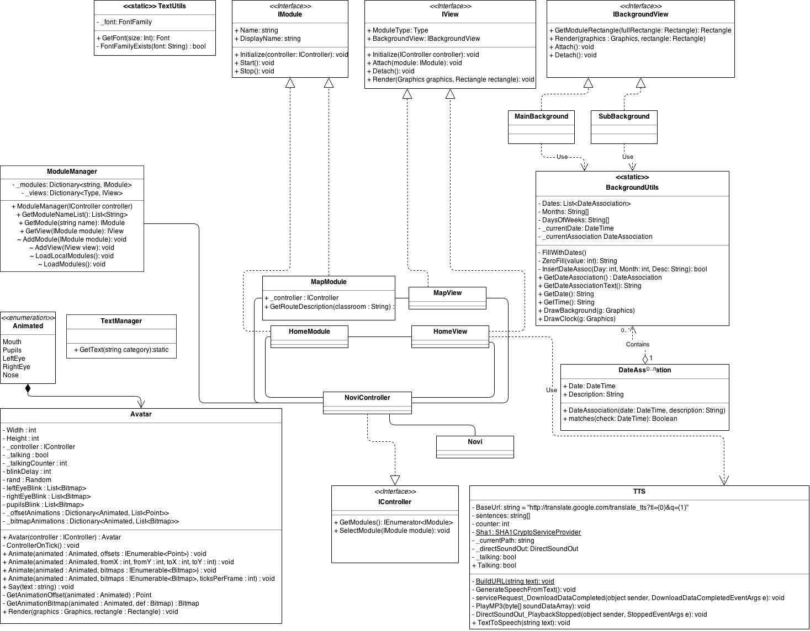

---
title: Technisch Ontwerp
authors:
- name: Arjan van der Weide
  snr: S1070619
- name: Robert Leeuwis
  snr: S1062367
- name: Joram Schrijver
  snr: S1067040
- name: Wouter Vogelzang
  snr: S1073684
- name: Evan van Urk
  snr: S1071256
- name: Janjaap Ree
  snr: S1066187
- name: Roelof Roos
  snr: S1073508
version: 0.1
date: November 2014
...

# Inleiding
In dit document staan de technische aspecten van het project beschreven. Er zullen hiervoor schematechnieken gebruikt worden die ons zijn geleerd.
Diagrammen zullen kort toegelicht worden om eventuele verwarring te voorkomen.

Was ist das?
============

> Wat moet hier in:
>  - Klassendiagram
>  - Toestandsdiagram
>  - Sequence diagram
>  - Extra uitleg bij (zeer) complexe onderdelen

========
# Ontwerpkeuzes

## Modules
Een eis van de opdrachtgever was om de applicatie zo op te zetten dat deze uit te breiden zou zijn door andere studenten.
Om deze reden hebben we ervoor gekozen om de applicatie op te delen in verschillende modules. Deze modules erfen een groot deel van hun attributen over zodat de layout (plaatsing avatar, datum/tijd, etc.) voor iedere module gelijk is.
Iedere module werkt met een Module en een View klasse. De achterliggende gedachte is dat de Module klasse gebruikt wordt om gegevens te verzamelen die in de view klasse getekent worden. 

Iedere aangemaakte module wordt automatisch getekent op het hoofdscherm met een icoontje dat gespecificeerd kan worden door de gebruiker.

## Diagrammen

=======
# Klassendiagram

=======
# Activitydiagram

In het bovenstaande diagram wordt globaal aangegeven op welke manier een gebruiker tussen de verschillende schermen kan schakelen.
Binnen het diagram kan een 'willekeurige module' ook het hoofdscherm zijn dit is compleet willekeurig.

=======
# Toestandsdiagram

=======
# Conclusie

